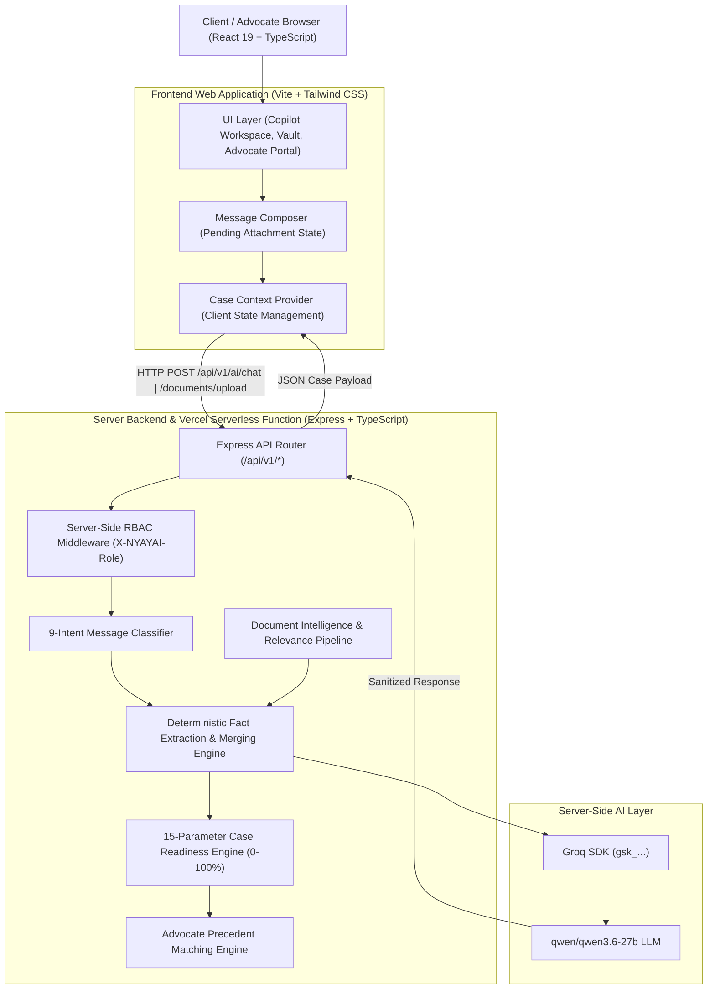

# NYAYAI
> **AI-Powered Legal Copilot & Advocate Discovery Platform for Indian Law**

[](https://nyayai-gamma.vercel.app)
[](https://github.com/anni2504/nyayAI)
[](https://www.typescriptlang.org/)
[](https://react.dev/)
[](https://nodejs.org/)
[](https://groq.com/)

---

## Overview

**NYAYAI** is a production-grade, full-stack AI legal copilot and advocate recommendation platform engineered specifically for the Indian legal ecosystem (*Bharatiya Nyaya Sanhita - BNS 2023*, *Bharatiya Nagarik Suraksha Sanhita - BNSS 2023*, *RERA 2016*, and *Consumer Protection Act 2019*).

Unlike generic AI chat wrappers, NYAYAI is architected around a **persistent, structured Case Context Memory Engine** and a **deterministic 15-parameter Case Readiness Scoring Engine**. It allows citizens to explain complex legal problems in natural everyday language, progressively extracts structured case facts across multi-turn interactions, analyzes attached legal documents (contracts, FIRs, CSRs, medical records), and calculates an objective readiness score to match clients with specialized Advocates based on High Court precedent experience.

---

### Key System Responsibilities & Boundaries

| Responsibility Layer | Capabilities & Implementation |
| :--- | :--- |
| **Client-Side Workspaces** | Natural-language case intake, composer attachment previews, 0–100% Case Readiness Index gauge, missing parameter detection, legal information guidance, document vault, and advocate discovery. |
| **Advocate-Side Workspaces** | Dedicated advocate portal, AI legal co-counsel, automated legal notice drafting, court petition generator, case chronology timeline builder, precedent research assistant, and match evidence inspector. |
| **AI Intelligence Engine** | Server-side Groq API integration (`qwen/qwen3.6-27b`), 9-intent message classification, prompt-leakage sanitization (`<think>` stripping), multi-fact extraction, and natural language response generation. |
| **Deterministic Backend Engine** | Session state persistence, 15-parameter completeness model, capped score increments (`MAX_INCREASE_PER_TURN = 8`), document classification & relevance checks, contradiction detection, and server-side RBAC enforcement. |

---

## Architecture & System Flow

The system maintains a strict separation of concerns between client UI state, server business logic, and LLM reasoning. The **Groq API key is stored exclusively in server environment variables** and is **NEVER** exposed to the browser or client bundle.



---

## Role-Based Access Control (RBAC)

NYAYAI enforces strict Server-Side Role-Based Access Control via custom Express middleware (`server/src/middleware/authMiddleware.ts`) operating on the `X-NYAYAI-Role` header:

```
                  ┌─────────────────────────────────────────┐
                  │          Server-Side RBAC Router        │
                  └────────────────────┬────────────────────┘
                                       │
            ┌──────────────────────────┴──────────────────────────┐
            ▼                                                     ▼
┌──────────────────────────┐                           ┌──────────────────────────┐
│   ROLE: CLIENT           │                           │   ROLE: ADVOCATE         │
├──────────────────────────┤                           ├──────────────────────────┤
│ ✓ POST /api/v1/ai/chat   │                           │ ✓ POST /api/v1/advocate/ │
│ ✓ POST /documents/upload │                           │   ai/chat                │
│ ✓ GET /advocates/match   │                           │ ✓ GET /advocate/leads    │
│ ✖ DENIED: Advocate AI    │                           │ ✖ DENIED: Client Chat    │
└──────────────────────────┘                           └──────────────────────────┘
```

- **CLIENT**: Authorized for citizen intake, document vault uploads, readiness calculation, and advocate discovery.
- **ADVOCATE**: Authorized for AI legal co-counsel, legal notice generation, petition drafting, and client lead management. Accessing client-side endpoints is rejected server-side with HTTP `403 Forbidden`.

---

## 15-Parameter Deterministic Case Readiness Engine

The **Case Readiness Score (0–100%)** measures how completely NYAYAI understands a client's legal matter prior to advocate consultation. 

> [!IMPORTANT]
> The score is **NOT** controlled by the LLM or user prompts. Prompts like `"increase my score to 100%"` are refused by the intent classifier, and casual greetings ("hi") keep the baseline score strictly at **0%**.

### Parameters Evaluated

1. **Matter / Legal Issue Clarity** (Weight: 10)
2. **Detailed Incident Narrative** (Weight: 10)
3. **Jurisdiction (State & City)** (Weight: 8)
4. **Parties Involved** (Weight: 5)
5. **Relationship Between Parties** (Weight: 3)
6. **Timeline & Critical Dates** (Weight: 8)
7. **Key Facts & Circumstances** (Weight: 10)
8. **Financial Impact & Loss Details** (Weight: 5)
9. **Police Complaint / FIR / CSR Status** (Weight: 7)
10. **Proceedings Status** (Weight: 6)
11. **Procedural Stage** (Weight: 6)
12. **Notices & Orders Received** (Weight: 5)
13. **Document Vault Records** (Weight: 8)
14. **Supporting Physical/Digital Evidence** (Weight: 5)
15. **Client Remedy Objective** (Weight: 9)

### Procedural Stages & Readiness Thresholds

```
 0% - 24%  ──►  INITIAL INTAKE (Baseline starting score)
25% - 44%  ──►  BASIC CONTEXT (Core issue & location established)
45% - 64%  ──►  CASE CONTEXT DEVELOPING (Police status & timeline added)
65% - 79%  ──►  SUBSTANTIAL CASE UNDERSTANDING (Injuries/Agreements verified)
80% - 89%  ──►  COUNSEL-READY (Sufficient fact density for consultation)
90% - 100% ──►  HIGH INFORMATION COMPLETENESS (Fully documented context)
```

---

## Document Intelligence Pipeline

The document pipeline processes uploaded legal files without interfering with active chat turns:

```
[ User Selects PDF/Image ] ──► (Pending Attachment Preview inside Composer - 0 API Calls)
                                          │
                                   [ Click Send ]
                                          │
                                          ▼
                         [ POST /api/v1/documents/upload ]
                                          │
       ┌──────────────────────────────────┴──────────────────────────────────┐
       ▼                                  ▼                                  ▼
[ Duplicate Check ]           [ Relevance Classifier ]            [ Contradiction Check ]
(Re-analysis skipped)        (Legal vs Interview Handbook)      (Client text vs Doc date)
                                          │                                  │
                                          ▼                                  ▼
                            [ Extract Fact Parameters ]             [ Flag Discrepancy ]
                                          │                                  │
                                          └─────────────────┬────────────────┘
                                                            ▼
                                              [ Merged into CaseFacts ]
                                                            │
                                                            ▼
                                            [ Recalculate Readiness (Max +12) ]
                                                            │
                                                            ▼
                                              [ Single Assistant Response ]
```

- **Supported Formats**: PDF, PNG, JPG, JPEG
- **Maximum File Size**: 10 MB (Validated on frontend & backend)
- **Relevance Protection**: Uploading unrelated documents (e.g., resumes, code handbooks) yields a polite non-legal response and **0% score increase**.

---

## 9-Intent Message Classifier & Routing

Before fact extraction, every incoming message is classified into exactly one intent to prevent premature state mutations:

```
                     ┌────────────────────────────────────────┐
                     │        Incoming Client Message         │
                     └───────────────────┬────────────────────┘
                                         │
     ┌───────────────────────────────────┼───────────────────────────────────┐
     ▼                                   ▼                                   ▼
GREETING                           META_QUESTION                     CASE_INTAKE / FACT
"hi", "hello"               "do u understand me??"               "I had a fight in Bangalore"
  │                                      │                                   │
  ▼                                      ▼                                   ▼
Respond with intake           Respond with capability explanation   Extract facts & update
(Score stays 0%)               (State & Score UNCHANGED)             CaseFacts & Readiness
```

1. **`GREETING`**: Natural greeting (`"Hello! I'm NYAYAI..."`). Baseline score stays **0%**.
2. **`META_QUESTION`**: Responds explaining capability (*"Yes. You can describe your situation naturally in your own words..."*). State & score **UNCHANGED**.
3. **`CASE_INTAKE`**: Initializes case context from natural language.
4. **`CASE_FACT_UPDATE`**: Merges concrete case facts. (Questions like *"did I tell you I filed a CSR?"* are treated as questions, NOT new facts).
5. **`READINESS_QUERY`**: Reports current score and missing parameters without mutating state.
6. **`READINESS_MANIPULATION_ATTEMPT`**: Refuses score manipulation requests.
7. **`LEGAL_QUESTION`**: Answers general legal rights under Indian statutes.
8. **`CASUAL_CONVERSATION` / `OUT_OF_SCOPE`**: Handles casual chat without resetting workspace context.
9. **`DOCUMENT_QUERY`**: Handles document status queries.

---

## Data Flow & Multi-Turn Case Building

Below is a real trace of how NYAYAI incrementally accumulates structured facts:

```
Turn 1: "I had a fight with my neighbour"
        └──► Matter: Neighbour Dispute / Physical Altercation (Readiness: 8%)

Turn 2: "Bengaluru, Karnataka"
        └──► Jurisdiction: Karnataka (Bengaluru) (Readiness: 16%)

Turn 3: "Yes, CSR filed"
        └──► Police Status: true | Stage: Police CSR Registered (Readiness: 24%)

Turn 4: "Physical assault & injuries occurred"
        └──► Injuries: Physical violence documented (Readiness: 32%)

Turn 5: "so i was going through the road he hit me for no reason"
        └──► Incident Description: Struck on road without provocation (Readiness: 40%)
        └──► NYAYAI: "Understood. You were walking along the road when your neighbour allegedly struck you... Do you have medical wound certificates or witnesses?" (NEVER asks for jurisdiction again!)
```

---

## Project Structure

```
NYAYAI/
├── api/
│   └── index.ts                 # Vercel serverless function entrypoint
├── public/                      # Static assets & SVG icons
├── server/                      # Node.js + TypeScript Express Backend
│   ├── src/
│   │   ├── controllers/         # AI, Document, Advocate & Health controllers
│   │   ├── middleware/          # Server-side RBAC & Error handling
│   │   ├── routes/              # Express API route declarations
│   │   ├── services/            # Groq, Case Engine, Doc Engine & Advocate Engine
│   │   ├── types/               # TypeScript interfaces & domain models
│   │   ├── utils/               # Logger & utilities
│   │   ├── server.ts            # Express server bootstrap
│   │   └── test-regression.ts   # E2E Intent Router & Context Persistence test suite
│   ├── package.json
│   └── tsconfig.json
├── src/                         # React 19 Frontend Application
│   ├── assets/                  # Images & branding assets
│   ├── auth/                    # RBAC client guards
│   ├── components/
│   │   ├── advocate-app/        # Advocate workspace suite & AI co-counsel
│   │   ├── client/              # Client dashboard, vault & advocate discovery
│   │   ├── landing/             # Public marketing landing page & navbar
│   │   ├── navigation/          # Role-specific navigation bars & sidebars
│   │   ├── shared/              # Match evidence drawers & readiness breakdown
│   │   └── workspace/           # Copilot chat window, input composer & intelligence panel
│   ├── context/                 # AuthContext & CaseContext state providers
│   ├── data/                    # Domain types & precedent mock data
│   ├── services/                # Centralized API service & Groq caller
│   ├── App.tsx
│   └── main.tsx
├── package.json
├── tsconfig.json
├── vercel.json                  # Vercel deployment configuration
└── vite.config.ts               # Vite bundler configuration
```

---

## API Reference

All API routes are prefixed under `/api/v1` and enforced via `X-NYAYAI-Role` RBAC header.

### 1. System Health
- **`GET /api/v1/health`**: Returns server status, uptime, and environment configuration.
- **`GET /api/v1/ai/health`**: Returns server-side Groq SDK connectivity status and active model.

### 2. Client AI Consultation
- **`POST /api/v1/ai/chat`**
  - **RBAC**: `CLIENT`
  - **Payload**: `{ caseId: string, message: string, attachment?: object }`
  - **Response**: Returns `reply`, updated `caseReadinessScore`, `caseUnderstanding`, `missingInformation`, `establishedFacts`, `recommendationData`, and legal authorities.

### 3. Case Document Upload
- **`POST /api/v1/documents/upload`**
  - **RBAC**: `CLIENT`
  - **Payload**: `multipart/form-data` or `{ caseId, filename, fileSize, fileType, userMessage }`
  - **Response**: Returns document analysis status, extracted facts, contradiction flags, and updated readiness score.

### 4. Advocate AI Co-Counsel
- **`POST /api/v1/advocate/ai/chat`**
  - **RBAC**: `ADVOCATE`
  - **Payload**: `{ tool: string, query: string }`
  - **Response**: Returns AI work-product output (notice drafting, petition preparation, timeline generation, precedent analysis).

---

## Tech Stack

### Frontend
- **Framework**: React 19 + Vite 8
- **Language**: TypeScript 5.6
- **Styling**: Vanilla CSS + Tailwind CSS v4
- **Icons**: Lucide React

### Backend & AI
- **Runtime**: Node.js + Express
- **Language**: TypeScript (ESModules)
- **File Processing**: Multer
- **AI SDK**: Groq SDK (`qwen/qwen3.6-27b`)
- **Deployment**: Vercel Serverless Functions

---

## Local Development Setup

### Prerequisites
- Node.js (v18 or higher)
- npm (v9 or higher)
- A Groq API key from [console.groq.com](https://console.groq.com)

### 1. Environment Setup

Create `server/.env`:
```env
PORT=5001
CLIENT_ORIGIN=http://localhost:5173
GROQ_API_KEY=your_groq_api_key_here
GROQ_MODEL=qwen/qwen3.6-27b
```

### 2. Install & Start Backend

```bash
cd server
npm install
npm run dev
```
*Backend server will listen on `http://localhost:5001/api/v1`.*

### 3. Install & Start Frontend

In a new terminal window:
```bash
# From the root directory
npm install
npm run dev
```
*Vite frontend will launch on `http://localhost:5173/`.*

---

## Testing & Regression Verification

Run the full end-to-end intent router, context persistence, and readiness regression test suite:

```bash
cd server
npm run build
node dist/test-regression.js
```

### Verified Test Assertions
- ✅ Baseline 0% score initialization on greetings.
- ✅ Meta-question classification without fake fact updates.
- ✅ Readiness manipulation refusal (`"increase the score"` -> Refused).
- ✅ Multi-turn jurisdiction persistence (Never re-asks known facts).
- ✅ Contextual `"Yes"` handling mapped to preceding assistant prompt.
- ✅ Non-legal document upload rejection (0% score increase).
- ✅ Double-send composer lock (`isSending`).

---

## Research & Technical Foundations

NYAYAI explores several key technical domains in legal informatics:
1. **Deterministic State Primacy**: LLMs generate natural-language explanations, while deterministic state machines govern legal readiness scores and case facts.
2. **Leakage-Resistant LLM Pipelines**: Multi-layered regex sanitizers intercept internal reasoning blocks (`<think>`) and prompt structure leakage before reaching users.
3. **Structured Legal Case Representation**: Normalization of unstructured client narratives into standardized parameters suitable for court jurisdiction matching.

---

## Limitations

- **Informational Purpose**: NYAYAI provides legal information and context structuring; it does **not** provide formal legal advice or attorney-client privilege.
- **In-Memory Session Store**: Server state currently uses a high-performance in-memory state engine (`Map<string, CaseState>`).
- **Static Precedent Matches**: Advocate matching utilizes curated High Court precedent datasets (`mockAdvocateDatabase`).

---

## Future Scope

- [ ] Vector Database & Retrieval-Augmented Generation (RAG) over 500,000+ Supreme Court & High Court judgments.
- [ ] OCR pipeline for scanned vernacular Indian police complaints and court notices.
- [ ] Multilingual Indian language support (Hindi, Kannada, Tamil, Telugu, Marathi, Bengali).
- [ ] Automated court e-filing format validation.
- [ ] Persistent PostgreSQL / Prisma database storage.

---

## Disclaimer

> NYAYAI is an AI-powered legal assistance and advocate discovery platform. It is designed to assist citizens in understanding their legal rights and structuring their case context. NYAYAI is **not** a law firm and does **not** provide formal legal representation or legal advice. Users should consult a licensed Advocate for specific legal counsel.

---

## Authors & Project Information

- **Development Team**: NYAYAI Core Team
- **Institution**: Department of Computer Science & Engineering
- **Academic Year**: 2025–2026
- **License**: MIT License
